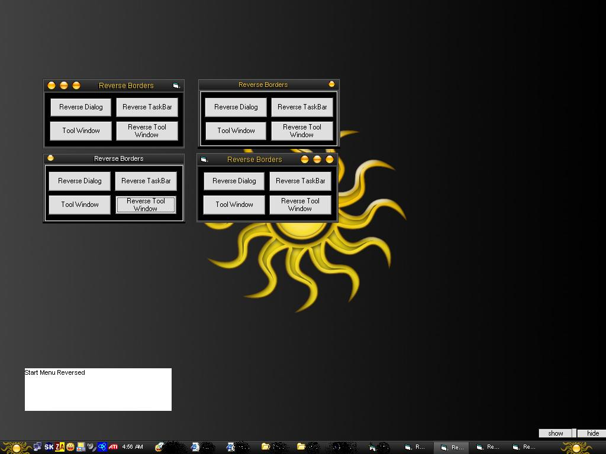



## Reverse Border Styles

### Description

My code will create a border style on runrime, and it can reverse the borders it can edit the border styles of any app if you get its handle. ive showed it rversing the taskbar as well I never found this code any where else I serached for months so finally I just Wrote my own code to do this so if you use it plz give me some feed back!
 
### More Info
 
You need to have a good grip on Windows Api.

             |
---                |---
**Submitted On**   |2005-04-28 04:52:40
**By**             |[Robert Bequette](https://github.com/Planet-Source-Code/PSCIndex/blob/master/ByAuthor/robert-bequette.md)
**Level**          |Advanced
**User Rating**    |4.6 (41 globes from 9 users)
**Compatibility**  |VB 5\.0, VB 6\.0
**Category**       |[Miscellaneous](https://github.com/Planet-Source-Code/PSCIndex/blob/master/ByCategory/miscellaneous__1-1.md)
**World**          |[Visual Basic](https://github.com/Planet-Source-Code/PSCIndex/blob/master/ByWorld/visual-basic.md)
**Archive File**   |[Reverse\_Bo1881854282005\.zip](https://github.com/Planet-Source-Code/robert-bequette-reverse-border-styles__1-60245/archive/master.zip)

